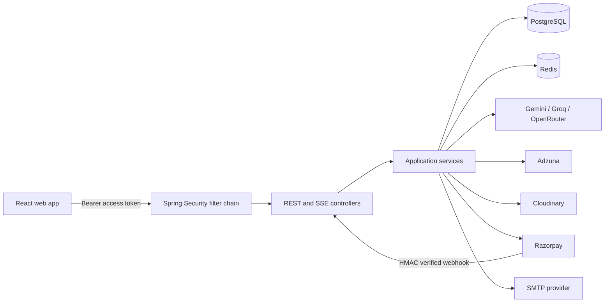
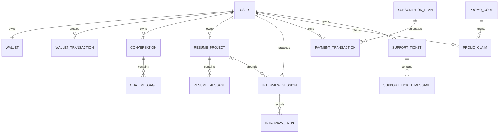
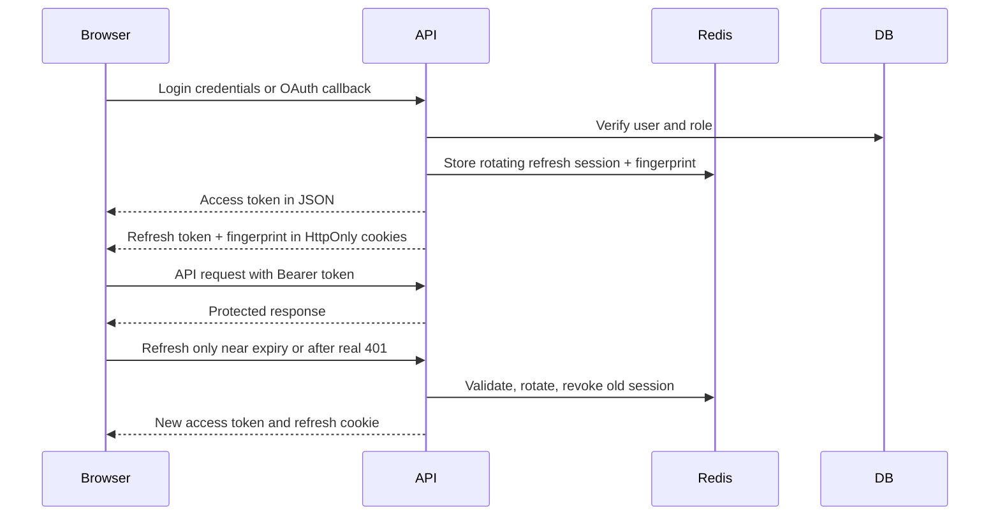
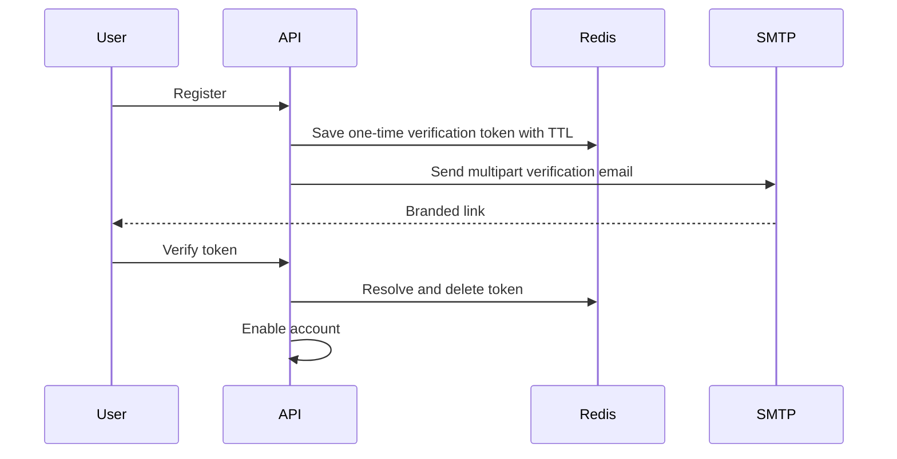
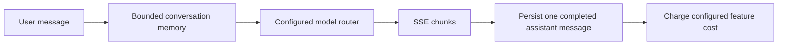
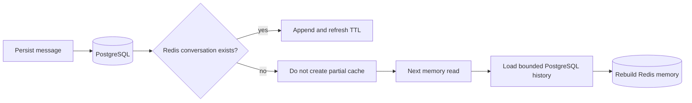
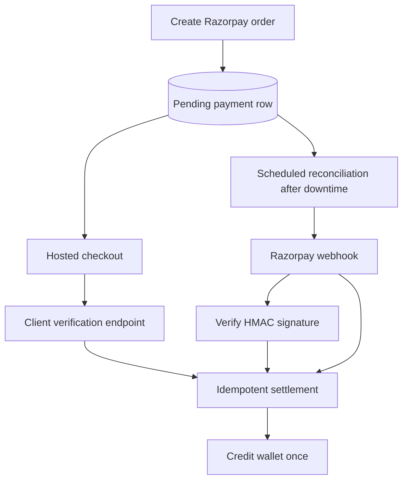
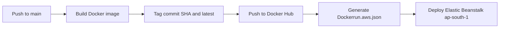

# CareerForge AI Backend

Spring Boot API for authentication, career AI, resume workflows, live interviews, payments, wallets, support, administration, and monitoring.

## Stack

- Java 21 and Spring Boot 3.3
- Spring Security, OAuth2 Client, JWT, HttpOnly cookies, CSRF protection
- PostgreSQL with Spring Data JPA and HikariCP
- Redis for refresh sessions, OTPs, verification tokens, caching, and rate limits
- WebClient for Gemini, Groq, OpenRouter, Adzuna, Cloudinary, and Razorpay integrations
- Server-Sent Events for streaming chat and resume coaching
- Micrometer Actuator metrics for health and operations

## Architecture



## Domain Model



Entity ownership is always checked with the authenticated user ID. Client-supplied IDs are not trusted as authorization.

## Authentication And Security



Security rules:

- Access tokens are short-lived and are not written to browser storage.
- Refresh token and fingerprint cookies are HttpOnly; production cookies must be `Secure`.
- Refresh rotation keeps the original user role and admin absolute-session deadline.
- `/api/admin/**` requires `ROLE_ADMIN`; admin login also requires an OTP.
- OAuth2 users are created as `ROLE_USER`; social login does not use a reusable password.
- CSRF protection is used for cookie-backed state-changing requests.
- Razorpay webhook payloads are accepted only after signature verification.
- Login, OTP, verification, AI, support, payment, and interview endpoints are rate limited.
- `.env`, deployment variables, provider keys, database credentials, and JWT secrets are ignored by Git.

## Email Verification And OTP



The mail service sends aligned `CareerForge AI` branding, a plain-text alternative, HTML content, Reply-To, and sent date. Inbox placement still requires domain authentication:

1. Use a sender address on your production domain, for example `security@careerforge.example`.
2. Publish the SMTP provider's SPF record.
3. Enable DKIM signing and publish the provider's DKIM records.
4. Publish DMARC, initially with monitoring such as `p=none`, then tighten after reports are clean.
5. Keep `MAIL_USERNAME`, visible From domain, Reply-To domain, and verification-link domain aligned.
6. Do not use a personal Gmail mailbox for production bulk transactional traffic.

Code cannot guarantee that a provider will never classify mail as spam; SPF, DKIM, DMARC, reputation, bounce handling, and content consistency decide final placement.

## AI Flows

### Career Chat



### Durable memory recovery



PostgreSQL is the durable source of truth. A Redis expiry or restart cannot reduce an old conversation to only the newest message: cold appends leave the key absent, then the memory builder hydrates bounded history from the database before the next model call.

### Resume AI

- Extracts PDF/DOCX text with file-size and content checks.
- Produces structured ATS analysis and optional job-description match.
- Supports resume-grounded coaching over SSE.
- Generates an ATS resume and downloadable PDF.
- Gemini model IDs and token budgets are configured in YAML/environment variables.

### Interview Practice

- Supports job interviews, campus placement, college admission, career changes, and general practice.
- Works for technical and non-technical professions.
- Accepts an existing analyzed resume or a newly uploaded resume.
- Accepts PDF, PNG, JPG, and WebP job descriptions through `POST /api/interviews/context/extract`.
- Text PDFs use local parsing without an AI charge; scanned documents use the configured Gemini vision model.
- Context extraction is signature-validated, rate-limited, bounded to 20,000 characters, wallet-charged from YAML/environment configuration, and refunded on provider failure.
- `InterviewContextExtractionService` and `InterviewContextExtractionServiceImpl` keep the service contract separate from implementation.
- Live rooms use a short-lived Gemini token; audio/video stream directly between browser and Gemini.
- The backend sends only bounded role, company, job description, preference, and verified resume context.
- Written answers are scored using relevance, correctness, evidence, structure, communication, and role fit.
- Short or vague answers have hard score caps; 90+ is reserved for exceptional evidence.
- Questions rotate across introduction, motivation, fundamentals, resume evidence, company fit, situations, communication, and closing reflection.
- Failed provider setup is refunded; wallet transactions use `FeatureType.INTERVIEW`.

## Payment Reliability



Payment settlement must remain idempotent. A client success page is not treated as proof of payment; server verification or a signed webhook is required.

## Cache And Load Control

- Redis caches reusable user/session state and stores ephemeral security data with TTLs.
- PostgreSQL remains the source of truth; cache misses fall back to the database.
- Search requests should be debounced in the frontend and rate limited in the backend.
- Hikari pool sizes are environment-controlled.
- JPA Open Session in View is disabled.
- Live interview media does not pass through the Spring Boot server.
- Large AI histories are bounded before provider calls.

## API Areas

| Area | Base path |
|---|---|
| Authentication | `/api/auth` |
| User profile | `/api/users` |
| Career chat | `/api/chat`, `/api/conversations` |
| Resume AI | `/api/resumes` |
| Interviews | `/api/interviews` |
| Cover letters | `/api/cover-letters` |
| Images | `/api/images` |
| Live jobs | `/api/jobs` |
| Wallet and plans | `/api/wallet`, `/api/plans`, `/api/promos` |
| Payments | `/api/payment` |
| Support | `/api/support/tickets` |
| Administration | `/api/admin` |
| Telemetry | `/api/telemetry` |

## Configuration

Business configuration is centralized in `src/main/resources/application-common.yml`; environment-specific infrastructure lives in `application-dev.yml` and `application-prod.yml`.

Required secret names include:

```env
DB_URL=
DB_USERNAME=
DB_PASSWORD=
UPSTASH_REDIS_HOST=
UPSTASH_REDIS_PORT=
UPSTASH_REDIS_TOKEN=
JWT_SECRET=
MAIL_USERNAME=
MAIL_PASSWORD=
MAIL_FROM_NAME=CareerForge AI
MAIL_REPLY_TO=
GOOGLE_CLIENT_ID=
GOOGLE_CLIENT_SECRET=
GITHUB_CLIENT_ID=
GITHUB_CLIENT_SECRET=
GEMINI_API_KEY=
GROQ_API_KEY=
OPENROUTER_API_KEY=
RAZORPAY_KEY_ID=
RAZORPAY_KEY_SECRET=
RAZORPAY_WEBHOOK_SECRET=
TOKEN_COST_INTERVIEW_CONTEXT=5
```

Never paste real values into README files, frontend variables, logs, screenshots, or issue reports. If a key was exposed in chat or a commit, revoke and rotate it immediately.

## CI/CD

`.github/workflows/docker.yml` deploys the backend on pushes to `main`:



Docker Hub and AWS credentials are supplied through GitHub Actions secrets. Application keys remain deployment environment variables and are not copied into the image, README, screenshots, or logs.
## Run And Verify

```powershell
.\mvnw.cmd spring-boot:run
```

Focused interview tests:

```powershell
.\mvnw.cmd "-Dtest=InterviewServiceTest,InterviewLiveTokenServiceTest" test
```

Full verification:

```powershell
.\mvnw.cmd test
```

Health endpoint: `http://localhost:9092/actuator/health`
